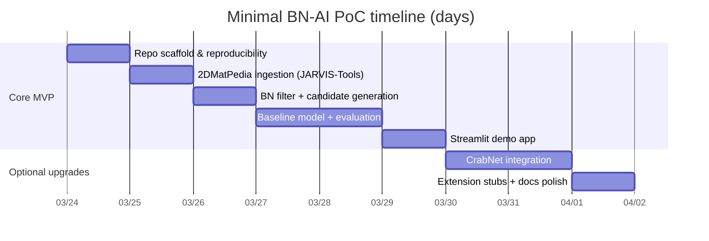

# Minimal, Fast-to-Implement AI PoC for “AI for Boron Nitride (BN)”

User prompt:
老师的消息如下: 
最近有人找我合作AI for 氮化硼的研究 
是的，这个项目还挺大的 
由于老师目前并没有给出项目的具体细节和应用场景(应该是合作方那边没有具体细节),我们没有关于项目的更多已知讯息,妳需要自行研究决定. 或许会有多种研究方向或切入方向,妳要抽象出这些方向之间的共性. 把高度相似的事情抽象出来,给出为完成这部分coding工作所需的计划.然后对于不同的分支,给出文字展望或代码文件夹留空就可以. 对于抽象出来的这部分共性, 应该能构成一个完整的pocdemo可以给老师展示,至少是个处理AI for 氮化硼问题的框架性的东西 我需要妳帮我研究一下,如何完成老师这个项目demo,poc可展示demo,制定一个计划.
一些补充如下: 
1. 使用英文进行研究 
2. 老师是cityu计算机系ai方向的教授,我是他的研究型硕士,我们没有化学材料方向的专业器材,妳的研究出发角度应该是ai 
3. 目前就完成一个demo,poc,没有资金支持,没有材料学专业仪器.项目应该是框架性质且精简的,能快速实现,快速展示的,具体内容可以慢慢补充.顺手给出妳的项目结构(tree形式),考虑到目前项目讯息较少,给出妳大概率能确定的结构就可以

## Executive summary

This report designs a compact, framework-level AI PoC/demo for “AI for boron nitride (BN)” that is implementable quickly, reproducible, and credible to a CityU CS AI professor and a research MSc student under strict constraints: **no chemistry lab access, no funding, no materials instruments, AI/software-only**. The guiding idea is to treat BN as a **materials-informatics case study** and build a **modular, reusable pipeline** where BN is a first-class “filter slice” across public computational datasets (2D and bulk) and text/image corpora. This aligns with how modern materials ML is commonly developed: train/benchmark on broad open data, then **specialize and evaluate on a target family** (BN-containing compounds / BN-like 2D materials), with transparent caveats about domain shift. citeturn1view0turn9search0

A key reason BN is a good “AI-only” target is that its influential forms (notably **2D hexagonal BN, h‑BN**) are widely studied computationally and appear in open datasets for 2D materials discovery and screening. For example, **2DMatPedia** provides **>6,000 monolayer structures** and is explicitly designed to support screening/data mining/ML; it even describes systematic **elemental substitution starting from BN** to generate many BN-analogs (e.g., B→{Al,Ga,In,Tl}, N→{P,As,Sb,Bi})—a direct blueprint for *data synthesis without a lab*. citeturn19view0turn19view1turn10view0

**Recommendation (implement now):** build a minimal “BN Explorer” PoC centered on **property prediction + candidate screening** for BN-containing 2D materials using **2DMatPedia via JARVIS-Tools** (fully programmatic download + caching) and a small set of baseline models (scikit-learn + optional CrabNet). This yields an end-to-end demo: data ingestion → BN filtering → featurization → training/evaluation → inference API → Streamlit UI. JARVIS-Tools is explicitly intended for data-driven atomistic materials design and provides structured access to datasets including **2DMatPedia (“twod_matpd”)** and **C2DB (“c2db”)**. citeturn5search5turn5search1turn9search0turn10view0

**Assumptions made (explicit):**  
The plan assumes (a) access to a standard laptop/desktop with **16–32 GB RAM** and internet (for one-time dataset downloads); (b) optional access to a **single consumer GPU** is helpful but not required for the MVP; (c) the goal is a **PoC-level scientific demonstration** with transparent limitations (DFT vs experiment differences, limited BN-specific labeled data), not a publish-ready state-of-the-art result.

## BN-focused AI directions and what to build first

The PoC should support multiple plausible BN directions, but implement only one end-to-end path initially and leave other modules as “stubs.” Below are **five viable AI-focused BN research directions** (3–6 required) with outlook, key public data sources, and what repository folders can be left empty.

### Viable directions comparison

| Direction | What the demo answers | Public data sources (examples) | Minimal baseline models | Outlook for a CS-AI audience | Folders that can stay empty in the repo (example) |
|---|---|---|---|---|---|
| BN property prediction & screening (recommended MVP) | “Given a BN(-containing) material (formula/structure), predict target properties; rank candidate BN analogs.” | **2DMatPedia** (>6k 2D structures) citeturn19view0turn10view0; **Matbench** tasks (e.g., band gap, formation energy; includes a 2D exfoliation-energy task “jdft2d” from JARVIS DFT 2D) citeturn1view0turn11view1; **JARVIS-DFT** (~40k+ bulk + ~1k low-dim) citeturn0search3turn9search7 | scikit-learn Gradient Boosting / RF + matminer features; optional **CrabNet** (composition-only transformer-like) citeturn0search9turn8search0 | Fast, measurable, reproducible; easy to turn into a live demo. Also aligns with Matbench’s emphasis on standardized evaluation for materials ML. citeturn1view0turn0search8 | `tasks/literature_mining/`, `tasks/stm_image_analysis/`, `tasks/structure_generation/`, `tasks/surrogate_potentials/` |
| BN structure generation / inverse design | “Generate plausible BN-like crystals/2D structures; optionally optimize for property proxy.” | **CDVAE** code + datasets (e.g., MP-20) citeturn4search3turn4search7; can filter generated outputs to BN-containing | Use pretrained generative pipeline (no retraining) + lightweight validity checks | More “researchy,” but higher complexity; best as an extension after MVP. | Most of repo except `tasks/structure_generation/` and core `data`/`viz` can be minimal; `apps/` optional |
| BN microscopy-style image analysis without lab | “From STM-like images: classify lattice type/material family; detect defects/patterns.” | **Computational STM image database** (DFT-generated STM images, **716 exfoliable 2D materials**) citeturn5search3turn5search7; also available via JARVIS ecosystem citeturn9search0 | Simple CNN / ViT fine-tune; heavy augmentation | Strong “AI vision” story; zero lab needed because images are computed (DFT). | Property modules can remain stubbed: `tasks/property_prediction/`, `models/torch_models/` optional |
| BN literature mining & knowledge graph | “What are BN applications, defect/doping trends, reported properties? Build a BN ‘map’.” | **MatSciBERT** (materials-domain LM) citeturn3search7turn3search19; **SciBERT** baseline citeturn6search0; **arXiv dataset** via JARVIS-Tools (1.8M titles/abstracts) citeturn9search0turn10view0 | Embedding search + clustering; weakly supervised NER/RE | Very CS-friendly; can auto-curate BN datasets from text, but evaluation labeling is a risk. | Structure/property modules can be empty: `tasks/property_prediction/`, `tasks/structure_generation/`, etc. |
| BN simulation surrogate / ML interatomic potentials (transfer) | “Approximate energies/forces/relaxations faster than DFT for BN structures using pretrained potentials.” | **CHGNet** pretrained universal potential (energies/forces/stress, pretrained on large MP trajectory data) citeturn8search5turn7search31; **MatGL** framework for GNN potentials citeturn8search22turn8search2 | Use pretrained inference; small validation subset from JARVIS-DFT/2DMatPedia | High impact if demoed well, but introduces more compute + engineering. | Many training modules can be stubbed; keep `tasks/surrogate_potentials/` + `viz/` |

**Why start with property prediction?** It is the fastest path to a coherent, end-to-end PoC with clear metrics and a UI, and it reuses components you will need anyway for other directions (dataset adapters, BN filtering, evaluation harness, visualization, inference endpoints). Matbench’s benchmark framing reinforces this approach: a reproducible pipeline with consistent evaluation is the baseline expectation in materials ML. citeturn1view0turn0search12

## Common framework components to abstract across directions

A compact framework should standardize *interfaces* and *schemas*, not overbuild. The goal is to keep direction-specific code small while sharing infrastructure.

### Shared components blueprint

**Data schema (core):** define a small set of record types with a common metadata envelope.

- `MaterialRecord`: `{record_id, source, formula, elements, structure(optional), targets(dict), split, provenance}`
- `ImageRecord`: `{record_id, source, image_path/bytes, label(s), metadata}`
- `TextRecord`: `{doc_id, source, title, abstract/fulltext(optional), entities(optional), relations(optional)}`

This can be enforced with Pydantic models (for runtime validation) and serialized to Parquet/JSON for reproducibility. The *same* “BN filter” should work across `MaterialRecord` and (via keyword/entity matching) `TextRecord`.

**Dataset adapters (core):** implement “download → parse → normalize” for a few primary sources:
- JARVIS-Tools adapter for `twod_matpd` (2DMatPedia) and `c2db` (C2DB) using `jarvis.db.figshare.data(...)`. citeturn9search0turn10view0
- Optional Matbench adapter for standardized property tasks and baselines. Matbench provides a curated benchmark suite (13 tasks) spanning properties and data sources (Materials Project, JARVIS DFT 2D, etc.). citeturn1view0turn11view1

**Preprocessing (core):**
- BN selection: `contains_elements({"B","N"})` and related variants (e.g., “BN + dopant”).
- Target cleaning: remove NaNs, cap outliers if needed, log-transform for heavy-tailed targets (documented).
- Split strategy: (a) random split for PoC; (b) grouped split by composition prototype as a more rigorous extension.

**Model interface (core):**
- `fit(train_df)`, `predict(df)`, `save()`, `load()`, `explain()` optional.
- Support both sklearn models and PyTorch models under the same interface.

**Model families (shared options):**
- Composition feature baselines using **matminer** (materials feature toolkit). citeturn0search9turn0search1  
- Composition-only deep models such as **CrabNet** (structure-agnostic property predictor). citeturn8search0turn7search0  
- Structure-based GNNs (optional): **CGCNN**, **MEGNet**, **ALIGNN**. citeturn3search24turn3search5turn3search2  
- Text models: **MatSciBERT** / **SciBERT** via Hugging Face Transformers. citeturn3search7turn6search0turn6search1

**Training & evaluation pipeline (core):**
- Config-driven runs (YAML) with fixed random seeds.
- Standard metrics: MAE/RMSE/R² for regression; ROC-AUC/F1 for classification. (Matbench uses ROC-AUC for classification and MAE for regression in its benchmark reporting context.) citeturn2view0turn1view0
- Artifact logging: save `metrics.json`, `model.pkl`/`model.pt`, and a `data_manifest.json` including dataset version/provenance.

**Interfaces & demo (core):**
- Notebook: fast scientific storytelling for professors/students.
- Streamlit app for interactive demo (minimal engineering; designed for ML/data apps). citeturn6search2turn6search6  
- Optional FastAPI inference endpoint (typed, auto-docs via OpenAPI). citeturn6search3turn6search11  

**Visualization (core):**
- Data: target distributions, BN vs non-BN comparatives.
- Model: parity plots, residual plots, error vs composition complexity.
- Screening: ranked candidate table; Pareto plots for multi-objective (e.g., high band gap + low exfoliation energy).

## Prioritized implementation plan, resources, and risk controls

The plan below is intentionally “minimum viable research engineering.” Time estimates are **minimal elapsed days** assuming one MSc student implementing full-time.

### Milestones and resource estimates

| Priority milestone | Output artifact(s) | Minimal time | Tools/libraries | Compute | Key risks | Mitigation |
|---|---|---:|---|---|---|---|
| Repo scaffold + reproducibility harness | Folder tree + `pyproject.toml`/requirements + `make`/CLI entrypoints | 1 day | Python, git, (optional) uv/poetry; basic CI | CPU | Dependency/version drift | Pin versions; cache raw data with checksums; save `data_manifest.json` (dataset name + retrieval date + source) |
| Data ingestion: 2DMatPedia via JARVIS-Tools | `data/raw/twod_matpd.json` (cached) + normalized Parquet | 1 day | `jarvis-tools` (dataset access), pandas | CPU + disk | Data schema surprises (keys vary) | Implement schema validation; keep adapter thin; log missing fields |
| BN filtering + candidate generator | BN subset dataset + synthetic BN-analog candidate list | 1 day | `pymatgen` for formula parsing, pandas | CPU | BN subset too small for training if filtered too hard | Train on full dataset, evaluate BN slice separately; also use 2DMatPedia’s BN substitution recipe for candidate generation citeturn19view1 |
| Baseline model training + evaluation | `metrics.json`, trained model artifact, plots | 1–2 days | `matminer` features citeturn0search9 + scikit-learn | CPU | Overfitting / data leakage | Strict split; avoid using target-leaking features; track columns |
| Demo UX | Streamlit app with “predict + screen BN analogs” | 1 day | Streamlit citeturn6search2 | CPU | UI distracts from science | Keep UI simple: input formula → predictions; “BN candidates” tab |
| Optional: CrabNet model path | Alternative model + interpretability visuals | 1–2 days | CrabNet + PyTorch citeturn8search0 | CPU or GPU | More setup complexity | Mark as optional plugin; ship baseline first |
| Optional: Extension hooks (stubs) | Empty task folders with README stubs | 0.5 day | n/a | n/a | Scope creep | Enforce “one working path” policy; keep stubs minimal |

**Compute guidance:** The MVP is designed to run on CPU. GPU becomes useful if you add structure-based GNNs (e.g., CGCNN/ALIGNN) or train CrabNet at scale. Matbench’s paper notes that crystal graph methods tend to outperform traditional models when datasets reach roughly **10⁴+** points, which suggests using GNNs mainly if you later incorporate larger structure datasets. citeturn1view0

### Timeline diagram (mermaid)



## Concrete PoC design to implement now: “BN Explorer” property predictor + screener

### What the PoC shows (demo narrative)

1. **Download a real scientific dataset** (2DMatPedia) programmatically using JARVIS-Tools (`twod_matpd`), cache it, and produce a normalized training table. citeturn9search0turn10view0  
2. **Train a reproducible predictor** for 2D material properties (e.g., PBE band gap; formation/decomposition-related targets when available). 2DMatPedia explicitly positions the dataset for screening/data mining/ML use. citeturn19view0turn18view0  
3. **Focus on BN**: filter to BN-containing entries, report model performance on the BN slice, and show predictions for (a) known BN entries and (b) systematically generated BN analogs using **2DMatPedia’s BN substitution recipe** (no lab required). citeturn19view1  
4. Provide an interactive **Streamlit** UI to input a formula and see predicted properties + uncertainty proxy (ensemble std or quantile model), plus a “candidate screening” table. citeturn6search2turn6search6

### Architecture diagram (mermaid)

```mermaid
flowchart LR
  subgraph Sources[Public data sources]
    A[2DMatPedia via JARVIS-Tools\n(twod_matpd)] -->|download+cache| D
    B[C2DB via JARVIS-Tools\n(optional c2db)] -->|optional| D
  end

  subgraph Core[BN Explorer core pipeline]
    D[Dataset adapter\nnormalize schema] --> E[BN filter\ncontains B & N]
    E --> F[Featurizer\n(matminer Magpie etc.)]
    F --> G[Model trainer\nsklearn baseline]
    G --> H[Evaluator\nCV + BN-slice metrics]
    H --> I[Artifacts\nmodel + metrics + plots]
  end

  subgraph Serving[Demo interfaces]
    I --> J[Streamlit app\ninteractive screening]
    I --> K[FastAPI endpoint\noptional]
  end
```

### Data sources and how to synthesize/augment without a lab

**Primary dataset (use in MVP):**  
- **2DMatPedia**: “more than 6,000 monolayer structures” with consistently computed properties, explicitly intended to support screening/data mining/AI. citeturn19view0turn18view0  
- Programmatic access via **JARVIS-Tools** dataset key `twod_matpd` (“Obtaining 2DMatPedia dataset 6k…”). citeturn10view0turn9search0  

**Optional dataset (extension):**  
- **C2DB** contains properties for ~4,000 2D materials across many structure types (useful for external validation / domain shift testing). citeturn4search1turn10view0  

**Lab-free synthesis/augmentation strategies (explicitly grounded in sources):**
- **Elemental substitution enumerator**: 2DMatPedia’s bottom-up workflow states that BN can generate **24 new materials** by combining group-13 elements for the B site and group-15 elements for the N site (example given directly in the paper). This is a principled way to create hypothetical BN analog candidates for screening, without claiming they are stable or synthesizable. citeturn19view1  
- **Data augmentation for models**: for composition-only models, you can augment with “nearby” compositions (small dopant fractions) as *unlabeled candidates* for inference-only ranking, not for supervised training (avoid label noise). This keeps the PoC honest: training remains on labeled DFT data; synthesis expands the inference/search space.

### Example model choices and minimal hyperparameters

Two-tier modeling keeps the PoC robust:

**Tier A (default, CPU-friendly): descriptor + scikit-learn**
- Features: matminer composition features (Magpie-style statistics) via matminer’s featurizers. citeturn0search9turn0search1  
- Model: `HistGradientBoostingRegressor` or `RandomForestRegressor` as a dependable baseline.
- Minimal hyperparameters (good defaults for PoC):
  - Gradient boosting: `max_depth=6`, `learning_rate=0.05`, `max_iter=500`, `min_samples_leaf=20`
  - Random forest: `n_estimators=500`, `max_depth=None`, `min_samples_leaf=2`

**Tier B (optional upgrade): CrabNet composition model**
- CrabNet is explicitly designed for structure-agnostic property prediction from chemical formula, and the paper reports competitive performance across benchmarks. citeturn8search0turn7search0  
- Minimal hyperparameters (PoC defaults; tune later): `d_model=512`, `n_heads=4`, `n_layers=3`, `dropout=0.1`, `batch_size=256`, `lr=3e-4`, `epochs=200`, early stopping patience 20.

### Evaluation protocol

A PoC should be transparent and reproducible, not overstated.

1. **Primary split:** random 80/10/10 train/val/test with fixed seed; log seed and split indices.
2. **Secondary BN-slice reporting:** compute the same metrics on the subset where `{"B","N"} ⊆ elements`. This directly supports the “AI for BN” narrative even if training is broader.
3. **Metrics:**
   - Regression: MAE + RMSE + R².
   - Ranking (screening): precision@K for “high band gap” candidates (if defining threshold), or top-K stability proxy.
4. **Baselines:** a “dummy mean predictor” baseline (MAE equals mean absolute deviation) and a linear model baseline.

Matbench emphasizes consistent evaluation procedures (nested CV for their benchmark), but for a fast PoC, a fixed split + BN-slice reporting is acceptable if documented. citeturn1view0turn2view0

### Demo UX

**Notebook (scientific walkthrough):**
- Step 1: dataset download + BN slice statistics  
- Step 2: train baseline + report metrics + parity plots  
- Step 3: generate BN analog candidates via substitution recipe + rank them + visualize Pareto front

**Streamlit app (stakeholder-facing):**
- Sidebar: choose model (Baseline / CrabNet), choose target property
- Tab “Predict”: input formula (e.g., BN, AlP-like analogs) → predicted property + uncertainty proxy
- Tab “BN Candidate Screener”: choose allowed substitutions → generate candidates → ranked table + scatter plot
- Tab “Model Diagnostics”: parity plot + residual histogram

Streamlit is explicitly positioned as a fast way to build and share data/ML apps in Python. citeturn6search2turn6search6

### Pipeline diagram (mermaid)

```mermaid
flowchart TD
  A[Download dataset\nJARVIS-Tools: twod_matpd] --> B[Normalize + cache\nParquet + manifest]
  B --> C[BN filter\ncontains B & N]
  C --> D[Featurize\nmatminer Magpie]
  D --> E[Train\nsklearn baseline]
  E --> F[Evaluate\n(test + BN-slice)]
  F --> G[Screen BN analogs\n(substitution enumerator)]
  G --> H[Visualize + export\nplots + ranked CSV]
  H --> I[Demo UI\nStreamlit + optional FastAPI]
```

## Codebase scaffold, folder tree, and minimal code snippets

### Project folder tree (core vs optional)

```text
bn-ai-poc/
  README.md                                # CORE: how to run the PoC
  pyproject.toml                           # CORE: pinned deps (or requirements/)
  configs/
    default.yaml                           # CORE: dataset/model/target settings
  data/
    .gitkeep
    raw/                                   # CORE (gitignored): cached downloads
    processed/                             # CORE (gitignored): parquet + splits
    sample/                                # CORE: tiny sample for CI/tests
  bnai/
    __init__.py
    schema.py                              # CORE: Pydantic record schemas
    adapters/                              # CORE: dataset adapters
      jarvis_twod_matpd.py                 # CORE: 2DMatPedia via JARVIS-Tools
      jarvis_c2db.py                       # OPTIONAL: C2DB adapter
      matbench.py                          # OPTIONAL: Matbench adapter
    preprocess/
      bn_filters.py                        # CORE: BN slicing logic
      featurize.py                         # CORE: matminer feature pipeline
      splits.py                            # CORE: reproducible splits
    models/
      base.py                              # CORE: unified model interface
      sklearn_baselines.py                 # CORE: RF/HGB/etc
      crabnet_wrapper.py                   # OPTIONAL: CrabNet integration
      gnn_wrappers/                        # OPTIONAL: CGCNN/ALIGNN hooks
        cgcnn.py
        alignn.py
    train/
      train.py                             # CORE: training entrypoint
      evaluate.py                          # CORE: metrics + BN-slice report
      metrics.py                           # CORE
    infer/
      predict.py                           # CORE: batch inference
      api_fastapi.py                       # OPTIONAL: FastAPI service
    viz/
      plots.py                             # CORE: parity/residual/screening plots
      report_cards.py                      # CORE: HTML/markdown summaries
    tasks/                                 # OPTIONAL: future directions
      literature_mining/                   # can be empty
      stm_image_analysis/                  # can be empty
      structure_generation/                # can be empty
      surrogate_potentials/                # can be empty
  apps/
    streamlit_app.py                       # CORE: demo UI
  notebooks/
    00_quickstart.ipynb                    # CORE
    01_bn_screening_demo.ipynb             # CORE
  tests/
    test_schema.py                         # CORE-lite
    test_bn_filter.py                      # CORE-lite
```

### Minimal code/pseudocode: dataset loader (2DMatPedia via JARVIS-Tools)

```python
# bnai/adapters/jarvis_twod_matpd.py
from __future__ import annotations
from dataclasses import dataclass
import pandas as pd

@dataclass(frozen=True)
class DatasetManifest:
    name: str
    source: str
    retrieved_at: str
    version_hint: str | None = None

def load_twod_matpd(cache_dir: str) -> tuple[pd.DataFrame, DatasetManifest]:
    """
    Loads 2DMatPedia (twod_matpd) via JARVIS-Tools and returns a normalized DataFrame.
    Requires: pip install jarvis-tools
    """
    from jarvis.db.figshare import data  # provided by jarvis-tools

    raw = data("twod_matpd")  # list[dict]
    df = pd.DataFrame(raw)

    # Normalize: require at least formula and target columns you choose
    # (column names may vary; discover and map them once, then pin the mapping)
    # Example: df["formula"] = df["formula"] or df["atoms"]["..."]

    manifest = DatasetManifest(
        name="twod_matpd",
        source="jarvis-tools / figshare",
        retrieved_at=pd.Timestamp.utcnow().isoformat(),
        version_hint="see jarvis.db.figshare mapping",
    )
    return df, manifest
```
JARVIS-Tools documents dataset access via `jarvis.db.figshare.data(...)` and lists `twod_matpd` as the 2DMatPedia dataset. citeturn9search0turn10view0

### Minimal code/pseudocode: BN filter + candidate generator (substitution-based)

```python
# bnai/preprocess/bn_filters.py
from __future__ import annotations
from typing import Iterable
import pandas as pd

def contains_elements(formula: str, required: set[str]) -> bool:
    # Small, dependency-light parser fallback (use pymatgen if available)
    import re
    elems = set(re.findall(r"[A-Z][a-z]?", formula))
    return required.issubset(elems)

def filter_bn(df: pd.DataFrame, formula_col: str = "formula") -> pd.DataFrame:
    mask = df[formula_col].astype(str).apply(lambda f: contains_elements(f, {"B", "N"}))
    return df.loc[mask].copy()

def generate_bn_group_substitutions() -> list[str]:
    """
    Based on 2DMatPedia bottom-up example:
    replace B with [B, Al, Ga, In, Tl] and N with [N, P, As, Sb, Bi].
    """
    group13 = ["B", "Al", "Ga", "In", "Tl"]
    group15 = ["N", "P", "As", "Sb", "Bi"]
    return [f"{x}{y}" for x in group13 for y in group15]
```

The explicit BN substitution example (producing 24 candidates) is described in the 2DMatPedia workflow discussion. citeturn19view1

### Minimal code/pseudocode: training loop (sklearn baseline)

```python
# bnai/train/train.py
from __future__ import annotations
import json
import numpy as np
import pandas as pd
from sklearn.model_selection import train_test_split
from sklearn.ensemble import RandomForestRegressor
from sklearn.metrics import mean_absolute_error, mean_squared_error, r2_score

def train_baseline(X: np.ndarray, y: np.ndarray, seed: int = 42):
    X_tr, X_te, y_tr, y_te = train_test_split(X, y, test_size=0.2, random_state=seed)
    model = RandomForestRegressor(n_estimators=500, random_state=seed, n_jobs=-1)
    model.fit(X_tr, y_tr)
    pred = model.predict(X_te)

    metrics = {
        "mae": float(mean_absolute_error(y_te, pred)),
        "rmse": float(mean_squared_error(y_te, pred, squared=False)),
        "r2": float(r2_score(y_te, pred)),
    }
    return model, metrics
```

### Minimal code/pseudocode: inference API (FastAPI optional)

```python
# bnai/infer/api_fastapi.py
from __future__ import annotations
from fastapi import FastAPI
from pydantic import BaseModel

app = FastAPI(title="BN Explorer API")

class PredictRequest(BaseModel):
    formula: str

class PredictResponse(BaseModel):
    formula: str
    prediction: float

@app.post("/predict", response_model=PredictResponse)
def predict(req: PredictRequest):
    # 1) featurize formula
    # 2) load trained model
    # 3) run prediction
    y_hat = 0.0  # placeholder
    return PredictResponse(formula=req.formula, prediction=y_hat)
```

FastAPI is designed for typed Python APIs and provides automatic OpenAPI documentation, making it suitable as an optional “engineering polish” layer. citeturn6search3turn6search11

### Suggested visualizations (what to show in the demo)

Use a small set of plots that convey scientific credibility:

- **Dataset summary:** BN vs non-BN counts; target histograms; BN-slice target distribution.
- **Model quality:** parity plot (y_true vs y_pred) + MAE/RMSE annotation; residual histogram.
- **BN screening:** scatter plot of predicted band gap vs predicted stability proxy; highlight Pareto frontier; top‑K candidate table.
- **Interpretability (optional):** permutation importance for top elemental statistics; for CrabNet, attention/element contribution visualizations (CrabNet emphasizes interpretability potential). citeturn8search0

## Primary sources to consult first

These are prioritized toward **official/primary** datasets, papers, and repositories for rapid implementation and credible citations.

1. **2DMatPedia paper + dataset** (top-down + bottom-up generation; >6k monolayers; BN substitution recipe) citeturn18view0turn19view1  
2. **JARVIS-Tools documentation + dataset catalog** (programmatic access to `twod_matpd`, `c2db`, `stm`, etc.) citeturn9search0turn5search5turn10view0  
3. **Matbench benchmark paper** (how materials ML is evaluated; task list; includes band gap, formation energy, and a 2D exfoliation-energy task sourced from JARVIS DFT 2D) citeturn1view0turn11view1  
4. **matminer toolkit paper + docs** (feature extraction and materials data mining utilities used widely in baseline pipelines) citeturn0search9turn0search1  
5. **pymatgen paper** (standard structure/formula tooling used across the community) citeturn0search10turn0search2  
6. **CrabNet paper + repo** (composition-only, structure-agnostic model with strong benchmark performance; good optional upgrade) citeturn8search0turn7search0  
7. **CGCNN paper/repo** (canonical crystal GNN baseline; useful if you extend to structure-heavy datasets like MP-derived tasks) citeturn3search24turn3search0  
8. **ALIGNN repo** (structure GNN with triplet interactions; also connected to JARVIS ecosystem) citeturn3search2turn3search18  
9. **MatSciBERT paper/repo + SciBERT paper** (if you extend to BN literature mining; good for NER/RE baselines) citeturn3search7turn6search4turn3search19  
10. **Computational STM image database** (DFT-generated STM images for 716 exfoliable 2D materials; image-analysis direction without lab) citeturn5search3turn5search7  
11. **CDVAE (crystal generative model)** (structure generation/inverse design extension) citeturn4search7turn4search3  
12. **CHGNet / MatGL** (pretrained universal potentials; surrogate simulation direction) citeturn8search5turn8search22turn8search2  

